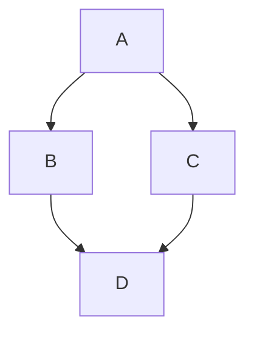

Retypeset определяет цветовые схемы темы на основе цветового пространства [OKLCH](https://oklch.com/), с предустановленной схемой черного, белого и серого цветов, имитирующей печатный стиль.

Для удовлетворения потребностей в персонализации я создал несколько цветовых схем для темы. Вы можете заменить стандартную цветовую схему в [src/config.ts](https://github.com/radishzzz/astro-theme-retypeset/blob/master/src/config.ts) и перезапустить сервер разработки, чтобы просмотреть новую цветовую схему.

## Бледно-зелёный


```
light: {
  primary: 'oklch(0.25 0.03 211.86)',
  secondary: 'oklch(0.40 0.03 211.86)',
  background: 'oklch(0.99 0.0039 106.47)',
  highlight: 'oklch(0.93 0.195089 103.2532 / 0.5)',
},
dark: {
  primary: 'oklch(0.92 0.0015 106.47)',
  secondary: 'oklch(0.79 0.0015 106.47)',
  background: 'oklch(0.24 0.0039 106.47)',
  highlight: 'oklch(0.93 0.195089 103.2532 / 0.2)',
},
```

## Воронёный


```
light: {
  primary: 'oklch(0.24 0.0172 280.05)',
  secondary: 'oklch(0.40 0.0172 280.05)',
  background: 'oklch(0.98 0.0172 280.05)',
  highlight: 'oklch(0.93 0.195089 103.2532 / 0.5)',
},
dark: {
  primary: 'oklch(0.92 0.0172 280.05)',
  secondary: 'oklch(0.79 0.0172 280.05)',
  background: 'oklch(0.24 0.0172 280.05)',
  highlight: 'oklch(0.93 0.195089 103.2532 / 0.2)',
},
```

## Чернильно-синий


```
light: {
  primary: 'oklch(0.24 0.053 261.24)',
  secondary: 'oklch(0.39 0.053 261.24)',
  background: 'oklch(1 0 0)',
  highlight: 'oklch(0.93 0.195089 103.2532 / 0.5)',
},
dark: {
  primary: 'oklch(0.92 0 0)',
  secondary: 'oklch(0.79 0 0)',
  background: 'oklch(0.24 0.016 265.21)',
  highlight: 'oklch(0.93 0.195089 103.2532 / 0.2)',
},
```

## Кремовый


```
light: {
  primary: 'oklch(0.25 0 0)',
  secondary: 'oklch(0.41 0 0)',
  background: 'oklch(0.95 0.0237 59.39)',
  highlight: 'oklch(0.93 0.195089 103.2532 / 0.5)',
},
dark: {
  primary: 'oklch(0.93 0.019 59.39)',
  secondary: 'oklch(0.80 0.017 59.39)',
  background: 'oklch(0.23 0 0)',
  highlight: 'oklch(0.93 0.195089 103.2532 / 0.2)',
},
```

======
---
title: Руководство по теме
published: 2025-01-26
updated: 2025-04-13
tags:
  - Тема блога
  - Руководство
pin: 99
lang: ru
abbrlink: theme-guide
---

Retypeset — это статическая тема блога, основанная на фреймворке [Astro](https://astro.build/). Данное руководство знакомит с тем, как изменять настройки темы и создавать новые статьи, помогая вам быстро настроить личный блог.

## Конфигурация темы

Настройте свой блог путем изменения конфигурационного файла [src/config.ts](https://github.com/radishzzz/astro-theme-retypeset/blob/master/src/config.ts).

### Информация о сайте

```ts
site: {
  // заголовок сайта
  title: 'Retypeset'
  // подзаголовок сайта
  subtitle: 'Revive the beauty of typography'
  // описание сайта
  description: 'Retypeset is a static blog theme...'
  // использовать многоязычные заголовок/подзаголовок/описание из src/i18n/ui.ts вместо статических выше
  i18nTitle: true // true | false
  // имя автора
  author: 'radishzz'
  // адрес сайта
  url: 'https://retypeset.radishzz.cc'
  // базовый путь
  // корневая директория для всех страниц и ресурсов
  base: '/' // например, '/blog', '/docs'
  // url фавикона
  // рекомендуемые форматы: svg, png или ico
  favicon: '/icons/favicon.svg' // или https://example.com/favicon.svg
}
```

### Цвет темы

```ts
color: {
  // режим темы по умолчанию
  mode: 'light' // light | dark | auto
  // светлый режим
  light: {
    // основной цвет
    // используется для заголовков, эффекта наведения и т.д.
    primary: 'oklch(25% 0.005 298)'
    // вторичный цвет
    // используется для текста постов
    secondary: 'oklch(40% 0.005 298)'
    // цвет фона
    background: 'oklch(96% 0.005 298)'
    // цвет выделения
    // используется для панели навигации, выделенного текста и т.д.
    highlight: 'oklch(0.93 0.195089 103.2532 / 0.5)'
  }
  // темный режим
  dark: {
    // основной цвет
    primary: 'oklch(92% 0.005 298)'
    // вторичный цвет
    secondary: 'oklch(77% 0.005 298)'
    // цвет фона
    background: 'oklch(22% 0.005 298)'
    // цвет выделения
    highlight: 'oklch(0.93 0.195089 103.2532 / 0.2)'
  }
}
```

### Глобальные настройки

```ts
global: {
  // язык по умолчанию
  // язык корневого пути сайта '/'
  locale: 'zh' // de | en | es | fr | ja | ko | pl | pt | ru | zh | zh-tw
  // дополнительные языки
  // создает многоязычные пути, такие как '/en/' '/es/'
  // не указывайте код языка, указанный выше, можно оставить пустым массивом []
  moreLocales: ['en', 'es', 'ja', 'ru', 'zh-tw'] // ['de', 'en', 'es', 'fr', 'ja', 'ko', 'pl', 'pt', 'ru', 'zh', 'zh-tw']
  // стиль шрифта статьи
  fontStyle: 'sans' // sans | serif
  // формат даты статьи
  // YYYY-MM-DD | MM-DD-YYYY | DD-MM-YYYY | MMM D YYYY | D MMM YYYY
  // 2025-04-13, 04-13-2025, 13-04-2025, Apr 13 2025，13 Apr 2025
  dateFormat: 'YYYY-MM-DD'
  // включить оглавление
  toc: true // true | false
  // включить математический рендеринг katex
  katex: true // true | false
  // уменьшить движение
  reduceMotion: false // true | false
}
```

### Система комментариев

```ts
comment: {
  // включить систему комментариев
  enabled: true // true | false
  // система комментариев giscus
  giscus: {
    repo: ''
    repoId: ''
    category: ''
    categoryId: ''
    mapping: 'pathname'
    strict: '0'
    reactionsEnabled: '1'
    emitMetadata: '0'
    inputPosition: 'bottom'
  }
  // система комментариев twikoo
  twikoo: {
    envId: ''
    // version: версию фронтенда можно изменить в package.json
  }
  // система комментариев waline
  waline: {
    // URL сервера
    serverURL: 'https://retypeset-comment.radishzz.cc'
    // URL эмодзи
    emoji: [
      'https://unpkg.com/@waline/emojis@1.2.0/tw-emoji'
      // 'https://unpkg.com/@waline/emojis@1.2.0/bmoji'
      // дополнительные эмодзи: https://waline.js.org/en/guide/features/emoji.html
    ]
    // поиск gif
    search: false // true | false
    // загрузчик изображений
    imageUploader: false // true | false
  }
}
```

### SEO

```ts
seo: {
  // @twitter ID
  twitterID: '@radishzz_'
  // верификация сайта
  verification: {
    // консоль поиска Google
    google: 'AUCrz5F1e5qbnmKKDXl2Sf8u6y0kOpEO1wLs6HMMmlM'
    // инструменты вебмастера Bing
    bing: '64708CD514011A7965C84DDE1D169F87'
    // вебмастер Яндекса
    yandex: ''
    // поиск Baidu
    baidu: ''
  }
  // Google Analytics
  googleAnalyticsID: ''
  // Umami Analytics
  umamiAnalyticsID: 'dab0e4b9-9cbf-43c3-af60-b09d3b545c38'
  // верификация folo
  folo: {
    // ID ленты
    feedID: ''
    // ID пользователя
    userID: ''
  }
  // ключ доступа apiflash
  // генерировать скриншоты веб-сайта для изображений open graph
  // получите ключ доступа на: https://apiflash.com/
  apiflashKey: ''
}
```

### Настройки подвала

```ts
footer: {
  // социальные ссылки
  links: [
    {
      name: 'RSS',
      url: '/atom.xml', // или /rss.xml
    },
    {
      name: 'GitHub',
      url: 'https://github.com/radishzzz/astro-theme-retypeset',
    },
    {
      name: 'Email',
      url: 'email@radishzz.cc',
    }
    // {
    //   name: 'X',
    //   url: 'https://x.com/radishzz_',
    // },
  ]
  // год начала работы веб-сайта
  startYear: 2025
}
```

### Предзагрузка ресурсов

```ts
preload: {
  // URL хостинга изображений
  // оптимизировать удаленные изображения и создавать заполнители низкого качества
  imageHostURL: 'image.radishzz.cc'
  // пользовательский скрипт Google Analytics
  // для пользователей, которые проксируют скрипты отслеживания через собственный домен
  customGoogleAnalyticsJS: ''
  // пользовательский скрипт Umami Analytics
  // для пользователей, которые самостоятельно разворачивают Umami или проксируют скрипты отслеживания через собственный домен
  customUmamiAnalyticsJS: 'https://views.radishzz.cc/script.js'
}
```

## Дополнительная конфигурация

Кроме файла конфигурации `src/config.ts`, некоторые параметры находятся в других файлах.

### Подсветка синтаксиса

Темы подсветки синтаксиса для блоков кода.

```ts
// astro.config.ts

shikiConfig: {
  // Доступные темы: https://shiki.style/themes
  // Цвет фона по умолчанию следует теме блога, а не теме подсветки синтаксиса
  themes: {
    light: 'github-light' // Светлая тема
    dark: 'github-dark' // Темная тема
  }
}
```

### Отрывок статьи

Количество символов для автоматических отрывков статей.

```ts
// src/utils/description.ts

const excerptLengths: Record<ExcerptScene, {
  cjk: number // Китайский, Японский, Корейский
  other: number // Другие языки
}> = {
  list: { // Список записей на главной странице
    cjk: 120, // Автоматически берет первые 120 символов
    other: 240, // Автоматически берет первые 240 символов
  },
}
```

### Open Graph

Стили [карточек Open Graph для социальных сетей](https://orcascan.com/tools/open-graph-validator?url=https%3A%2F%2Fretypeset.radishzz.cc%2Fru%2Fposts%2Ftheme-guide%2F).

```ts
// src/pages/og/[...image].ts

getImageOptions: (_path, page) => ({
  logo: {
    path: './public/icons/og-logo.png', // Требуется локальный путь и формат PNG
    size: [250], // Ширина логотипа
  },
  font: {
    title: { // Заголовок
      families: ['Noto Sans SC'], // Шрифт
      weight: 'Bold', // Вес
      color: [34, 33, 36], // Цвет
      lineHeight: 1.5, // Высота строки
    },
  },
  fonts: [ // Пути к шрифтам (локальные или удаленные)
    'https://cdn.jsdelivr.net/gh/notofonts/noto-cjk@main/Sans/SubsetOTF/SC/NotoSansSC-Bold.otf',
    'https://cdn.jsdelivr.net/gh/notofonts/noto-cjk@main/Sans/SubsetOTF/SC/NotoSansSC-Regular.otf',
  ],
  bgGradient: [[242, 241, 245]], // Цвет фона
  // Дополнительные настройки: https://github.com/delucis/astro-og-canvas/tree/latest/packages/astro-og-canvas
})
```

### RSS-лента

Стили [страницы RSS-ленты](https://retypeset.radishzz.cc/ru/atom.xml).

```html
<!-- public/feeds/xxx-style.xsl -->

<style type="text/css">
body{color:oklch(25% 0.005 298)} /* Цвет шрифта */
.bg-white{background-color:oklch(0.96 0.005 298)!important} /* Цвет фона */
.text-gray{color:oklch(0.25 0.005 298 / 75%)!important} /* Вторичный цвет шрифта */
</style>
```

## Создание новой статьи

Выполните команду `pnpm new-post <filename>` для создания новой статьи, которую затем можно редактировать в директории `src/content/posts/`.

```bash
pnpm new-post                      ->  src/content/posts/new-post.md
pnpm new-post first-post           ->  src/content/posts/first-post.md
pnpm new-post 2025/03/first-post   ->  src/content/posts/2025/03/first-post.md
pnpm new-post first-post.mdx       ->  src/content/posts/first-post.mdx
```

### Front Matter

Только поля `title` и `published` являются обязательными, все остальные конфигурации можно опустить.

```markdown
---
# Обязательные
title: Руководство по теме
published: 2025-01-26

# Опциональные
description: Первые 240 символов статьи будут автоматически выбраны в качестве отрывка.
updated: 2025-03-26
tags:
  - Тема блога
  - Руководство

# Расширенные, опциональные
draft: true/false
pin: 0-99
toc: true/false
lang: de/en/es/fr/ja/ko/pl/pt/ru/zh/zh-tw
abbrlink: theme-guide
---
```

### Расширенные настройки

#### draft

Отметить статью как черновик. Когда установлено значение true, статью нельзя опубликовать, и она доступна только для локального предварительного просмотра. По умолчанию — false.

#### pin

Закрепить статью вверху. Чем выше число, тем выше приоритет закрепленной статьи. По умолчанию — 0, что означает отсутствие закрепления.

#### toc

Генерировать оглавление. Показывает заголовки от h2 до h4. По умолчанию определяется глобальным параметром `global.toc`, но может быть изменен индивидуально в каждой статье.

#### lang

Указывает язык статьи. Можно указать только один язык. Если не указано, статья будет отображаться по умолчанию во всех языковых путях.

```md
# src/config.ts
# locale: 'en'
# moreLocales: ['es', 'ru']

# lang: ''
src/content/posts/apple.md  ->  example.com/posts/apple/
                            ->  example.com/es/posts/apple/
                            ->  example.com/ru/posts/apple/
# lang: en
src/content/posts/apple.md  ->  example.com/posts/apple/
# lang: es
src/content/posts/apple.md  ->  example.com/es/posts/apple/
# lang: ru
src/content/posts/apple.md  ->  example.com/ru/posts/apple/
```

#### abbrlink

Настраивает URL статьи. Может содержать только строчные буквы, цифры и дефисы `-`.

```md
# src/config.ts
# locale: 'en'
# moreLocales: ['es', 'ru']
# lang: 'es'

# abbrlink: ''
src/content/posts/apple.md           ->  example.com/es/posts/apple/
src/content/posts/guide/apple.md     ->  example.com/es/posts/guide/apple/
src/content/posts/2025/03/apple.md   ->  example.com/es/posts/2025/03/apple/

# abbrlink: 'banana'
src/content/posts/apple.md           ->  example.com/es/posts/banana/
src/content/posts/guide/apple.md     ->  example.com/es/posts/banana/
src/content/posts/2025/03/apple.md   ->  example.com/es/posts/banana/
```

### Форматирование смешанного текста

Запустите `pnpm format-posts` для оптимизации форматирования в Markdown-файлах в директории `src/content/`. Эта команда автоматически исправляет пробелы между символами CJK (китайский, японский, корейский) и латиницей, корректирует знаки пунктуации и улучшает общую читаемость текста.

```bash
pnpm format-posts
🔍 Scanning Markdown files...
📦 Found 56 Markdown files
✅ src/content/posts/guides/Theme Guide-ja.md
✅ src/content/posts/guides/Theme Guide-zh-tw.md
✅ src/content/posts/guides/Theme Guide-zh.md
✨ Formatted 3 files successfully
```

=======
---
title: Расширенные функции Markdown
published: 2025-04-25
tags:
  - Руководство
toc: false
lang: ru
abbrlink: markdown-extended-features
---

Здесь представлены некоторые расширенные функции Markdown, поддерживаемые темой Retypeset, включая примеры синтаксиса и их стилистические эффекты.

## Подписи к изображениям

Для создания автоматических подписей к изображениям используйте стандартный синтаксис изображений Markdown ``. Чтобы скрыть подпись, добавьте подчёркивание `_` перед текстом `alt` или оставьте текст `alt` пустым.

### Синтаксис

```


```

### Результат


## Блоки примечаний

Для создания блоков примечаний используйте синтаксис GitHub `> [!TYPE]` или контейнерную директиву `:::type`. Поддерживаются следующие типы: `note`, `tip`, `important`, `warning` и `caution`.

### Синтаксис

```
> [!NOTE]
> Полезная информация, которую пользователи должны знать, даже при беглом просмотре.

> [!TIP]
> Полезные советы, как делать что-то лучше или проще.

> [!IMPORTANT]
> Ключевая информация, которую пользователи должны знать для достижения своей цели.

:::warning
Срочная информация, требующая немедленного внимания пользователя для предотвращения проблем.
:::

:::caution
Предупреждает о рисках или негативных последствиях определённых действий.
:::

:::note[ПОЛЬЗОВАТЕЛЬСКИЙ ЗАГОЛОВОК]
Это примечание с пользовательским заголовком.
:::
```

### Результат

> [!NOTE]
> Полезная информация, которую пользователи должны знать, даже при беглом просмотре.

> [!TIP]
> Полезные советы, как делать что-то лучше или проще.

> [!IMPORTANT]
> Ключевая информация, которую пользователи должны знать для достижения своей цели.

:::warning
Срочная информация, требующая немедленного внимания пользователя для предотвращения проблем.
:::

:::caution
Предупреждает о рисках или негативных последствиях определённых действий.
:::

:::note[ПОЛЬЗОВАТЕЛЬСКИЙ ЗАГОЛОВОК]
Это примечание с пользовательским заголовком.
:::

## Сворачиваемые разделы

Для создания сворачиваемых разделов используйте синтаксис контейнерной директивы `:::fold[title]`. Нажмите на заголовок, чтобы развернуть или свернуть раздел.

### Синтаксис

```
:::fold[Советы по использованию]
Контент, который может не заинтересовать всех читателей, можно поместить в сворачиваемый раздел.
:::
```

### Результат

:::fold[Советы по использованию]
Контент, который может не заинтересовать всех читателей, можно поместить в сворачиваемый раздел.
:::

## Диаграммы Mermaid

Для создания диаграмм Mermaid оберните синтаксис Mermaid в блоки кода и укажите тип языка как `mermaid`.

### Синтаксис

``````

``````

### Результат


## Галереи

Для создания галерей изображений используйте контейнерную директиву `:::gallery`. Прокручивайте горизонтально, чтобы просмотреть больше изображений.

### Синтаксис

```
:::gallery


:::
```

### Результат

:::gallery


:::

## Репозитории GitHub

Для встраивания репозиториев GitHub используйте листовую директиву `::github{repo="owner/repo"}`.

### Синтаксис

```
::github{repo="radishzzz/astro-theme-retypeset"}
```

### Результат

::github{repo="radishzzz/astro-theme-retypeset"}

## Видео

Для встраивания видео используйте листовую директиву `::youtube{id="video-id"}`.

### Синтаксис

```
::youtube{id="9pP0pIgP2kE"}

::bilibili{id="BV1sK4y1Z7KG"}
```

### Результат

::youtube{id="9pP0pIgP2kE"}

::bilibili{id="BV1sK4y1Z7KG"}

## Spotify

Для встраивания контента Spotify используйте листовую директиву `::spotify{url="spotify-url"}`.

### Синтаксис

```
::spotify{url="https://open.spotify.com/track/0HYAsQwJIO6FLqpyTeD3l6"}

::spotify{url="https://open.spotify.com/album/03QiFOKDh6xMiSTkOnsmMG"}
```

### Результат

::spotify{url="https://open.spotify.com/track/0HYAsQwJIO6FLqpyTeD3l6"}

::spotify{url="https://open.spotify.com/album/03QiFOKDh6xMiSTkOnsmMG"}

## Твиты

Для встраивания твитов используйте листовую директиву `::tweet{url="tweet-url"}`.

### Синтаксис

```
::tweet{url="https://x.com/hachi_08/status/1906456524337123549"}
```

### Результат

::tweet{url="https://x.com/hachi_08/status/1906456524337123549"}

## CodePen

Для встраивания демо CodePen используйте листовую директиву `::codepen{url="codepen-url"}`.

### Синтаксис

```
::codepen{url="https://codepen.io/jh3y/pen/NWdNMBJ"}
```

### Результат

::codepen{url="https://codepen.io/jh3y/pen/NWdNMBJ"}

=========
---
title: Руководство по стилю Markdown
published: 2025-03-08
updated: 2025-03-23
tags:
  - Руководство
pin: 98
toc: false
lang: ru
abbrlink: markdown-style-guide
---

Вот несколько примеров базового синтаксиса Markdown и их стилистических эффектов в теме Retypeset.

## Заголовки

Чтобы создать заголовки, добавьте знаки решётки `#` перед словом или фразой. Количество знаков решётки должно соответствовать уровню заголовка.

### Синтаксис

```
# Заголовок 1
## Заголовок 2
### Заголовок 3
#### Заголовок 4
##### Заголовок 5
###### Заголовок 6
```

### Результат

# Заголовок 1
## Заголовок 2
### Заголовок 3
#### Заголовок 4
##### Заголовок 5
###### Заголовок 6

## Абзацы

Для создания абзацев используйте пустую строку для разделения одной или нескольких строк текста.

### Синтаксис

```
Xerum, quo qui aut unt expliquam qui dolut labo. Aque venitatiusda cum, voluptionse latur sitiae dolessi aut parist aut dollo enim qui voluptate ma dolestendit peritin re plis aut quas inctum laceat est volestemque commosa as cus endigna tectur, offic to cor sequas etum rerum idem sintibus eiur? Quianimin porecus evelectur, cum que nis nust voloribus ratem aut omnimi, sitatur? Quiatem. Nam, omnis sum am facea corem alique molestrunt et eos evelece arcillit ut aut eos eos nus, sin conecerem erum fuga. Ri oditatquam, ad quibus unda veliamenimin cusam et facea ipsamus es exerum sitate dolores editium rerore eost, temped molorro ratiae volorro te reribus dolorer sperchicium faceata tiustia prat.

Itatur? Quiatae cullecum rem ent aut odis in re eossequodi nonsequ idebis ne sapicia is sinveli squiatum, core et que aut hariosam ex eat.
```

### Результат

Xerum, quo qui aut unt expliquam qui dolut labo. Aque venitatiusda cum, voluptionse latur sitiae dolessi aut parist aut dollo enim qui voluptate ma dolestendit peritin re plis aut quas inctum laceat est volestemque commosa as cus endigna tectur, offic to cor sequas etum rerum idem sintibus eiur? Quianimin porecus evelectur, cum que nis nust voloribus ratem aut omnimi, sitatur? Quiatem. Nam, omnis sum am facea corem alique molestrunt et eos evelece arcillit ut aut eos eos nus, sin conecerem erum fuga. Ri oditatquam, ad quibus unda veliamenimin cusam et facea ipsamus es exerum sitate dolores editium rerore eost, temped molorro ratiae volorro te reribus dolorer sperchicium faceata tiustia prat.

Itatur? Quiatae cullecum rem ent aut odis in re eossequodi nonsequ idebis ne sapicia is sinveli squiatum, core et que aut hariosam ex eat.

## Изображения

Чтобы добавить изображения, добавьте восклицательный знак `!`, за которым следует альтернативный текст в квадратных скобках `[]` и путь или URL к изображению в круглых скобках `()`.

### Синтаксис

```


```

### Результат


## Цитаты

Чтобы создать цитаты, добавьте символ `>` и пробел перед текстом. Цитаты могут содержать несколько абзацев. Для указания источников используйте теги `<cite>` или `<footer>`, а сноски можно вставить с помощью синтаксиса `[^1]` или `[^note]`.

### Цитата с несколькими абзацами

#### Синтаксис

```markdown
> Tiam, ad mint andaepu dandae nostion secatur sequo quae.
>
> **Обратите внимание**, что внутри цитаты можно использовать _синтаксис Markdown_.
```

#### Результат

> Tiam, ad mint andaepu dandae nostion secatur sequo quae.
>
> **Обратите внимание**, что внутри цитаты можно использовать _синтаксис Markdown_.

### Цитата с указанием источников

#### Синтаксис

```markdown
> Не общайтесь путём разделения памяти, разделяйте память путём общения.
>
> — <cite>Роб Пайк[^1]</cite>

[^1]: Приведённая выше цитата взята из [выступления](https://www.youtube.com/watch?v=PAAkCSZUG1c) Роба Пайка на Gopherfest, 18 ноября 2015 года.
```

#### Результат

> Не общайтесь путём разделения памяти, разделяйте память путём общения.
>
> — <cite>Роб Пайк[^1]</cite>

[^1]: Приведённая выше цитата взята из [выступления](https://www.youtube.com/watch?v=PAAkCSZUG1c) Роба Пайка на Gopherfest, 18 ноября 2015 года.

## Таблицы

Чтобы добавить таблицы, используйте три или более дефиса `---` для создания заголовка каждого столбца и вертикальные линии `|` для разделения столбцов.

### Синтаксис

```markdown
| Курсив     | Жирный      | Код    |
| ---------- | ----------- | ------ |
| _курсив_   | **жирный**  | `код`  |
| _курсив_   | **жирный**  | `код`  |
```

### Результат

| Курсив     | Жирный      | Код    |
| ---------- | ----------- | ------ |
| _курсив_   | **жирный**  | `код`  |
| _курсив_   | **жирный**  | `код`  |

## Блоки кода

Чтобы создать блоки кода, оберните ваш код тремя обратными апострофами ```` ``` ````. Вы можете указать язык программирования после открывающих обратных апострофов, чтобы указать, как раскрашивать и стилизовать ваш код, например: html, javascript, css, markdown и т.д.

### Синтаксис

````
```html
<!doctype html>
<html lang="ru">
  <head>
    <meta charset="utf-8" />
    <title>Пример документа HTML5</title>
  </head>
  <body>
    <p>Тест</p>
  </body>
</html>
```
````

### Результат

```html
<!doctype html>
<html lang="ru">
  <head>
    <meta charset="utf-8" />
    <title>Пример документа HTML5</title>
  </head>
  <body>
    <p>Тест</p>
  </body>
</html>
```

## Типы списков

### Упорядоченный список

#### Синтаксис

```markdown
1. Первый пункт
2. Второй пункт
3. Третий пункт
```

#### Результат

1. Первый пункт
2. Второй пункт
3. Третий пункт

### Неупорядоченный список

#### Синтаксис

```markdown
- Пункт списка
- Графический элемент
- И ещё один пункт
```

#### Результат

- Пункт списка
- Графический элемент
- И ещё один пункт

### Вложенный список

#### Синтаксис

```markdown
- Фрукты
  - Яблоко
  - Апельсин
  - Банан
- Молочные продукты
  - Молоко
  - Сыр
```

#### Результат

- Фрукты
  - Яблоко
  - Апельсин
  - Банан
- Молочные продукты
  - Молоко
  - Сыр

## Другие элементы

Включая верхний индекс `<sup>`, нижний индекс `<sub>`, аббревиатуру `<abbr>`, зачёркнутый текст `<del>`, волнистое подчёркивание `<u>`, ввод с клавиатуры `<kbd>`, выделение `<mark>` и горизонтальную линию `<hr>`.

### Синтаксис

```html
H<sub>2</sub>O

X<sup>n</sup> + Y<sup>n</sup> = Z<sup>n</sup>

<abbr title="Graphics Interchange Format">GIF</abbr> — это формат растровых изображений.

Хорошие писатели всегда проверяют <u title="правописание">правописание</u>.

Нажмите <kbd>CTRL</kbd> + <kbd>ALT</kbd> + <kbd>Delete</kbd>, чтобы завершить сеанс.

Нет <del>ничего</del> ни хорошего, ни плохого кода, но запуск делает его таковым.

Большинство <mark>саламандр</mark> ведут ночной образ жизни и охотятся на насекомых, червей и других мелких существ.

Используйте три дефиса `---` или тег `<hr>` для создания горизонтальной линии, как показано ниже.

---
```

### Результат

H<sub>2</sub>O

X<sup>n</sup> + Y<sup>n</sup> = Z<sup>n</sup>

<abbr title="Graphics Interchange Format">GIF</abbr> — это формат растровых изображений.

Хорошие писатели всегда проверяют <u title="правописание">правописание</u>.

Нажмите <kbd>CTRL</kbd> + <kbd>ALT</kbd> + <kbd>Delete</kbd>, чтобы завершить сеанс.

Нет <del>ничего</del> ни хорошего, ни плохого кода, но запуск делает его таковым.

Большинство <mark>саламандр</mark> ведут ночной образ жизни и охотятся на насекомых, червей и других мелких существ.

Используйте три дефиса `---` или тег `<hr>` для создания горизонтальной линии, как показано ниже.

---

# Retypeset


[简体中文](assets/docs/README.zh.md)｜[繁体中文](assets/docs/README.zh-tw.md)｜[日本語](assets/docs/README.ja.md)｜[Español](assets/docs/README.es.md)｜[Français](assets/docs/README.fr.md)｜[Русский](assets/docs/README.ru.md)

Retypeset is a static blog theme based on the [Astro](https://astro.build/) framework. Inspired by [Typography](https://astro-theme-typography.vercel.app/), Retypeset establishes a new visual standard and reimagines the layout of all pages, creating a reading experience reminiscent of paper books, reviving the beauty of typography. Details in every sight, elegance in every space.

## Demo

- [Retypeset](https://retypeset.radishzz.cc/en/)
- [Retipografía](https://retypeset.radishzz.cc/es/)
- [Переверстка](https://retypeset.radishzz.cc/ru/)
- [重新编排](https://retypeset.radishzz.cc/)
- [重新編排](https://retypeset.radishzz.cc/zh-tw/)
- [再組版](https://retypeset.radishzz.cc/ja/)

## Features

- Built with Astro and UnoCSS
- Support for SEO, Sitemap, OpenGraph, RSS, MDX, LaTeX, Mermaid, and TOC
- i18n support
- Light / Dark mode
- Elegant view transitions
- Rich theme customization
- Optimized typography
- Responsive design
- Comment system

## Performance

<br>
<p align="center">
  <a href="https://pagespeed.web.dev/analysis?url=https%3A%2F%2Fretypeset.radishzz.cc%2Fen%2F&form_factor=desktop">
    
  <a>
</p>

## Getting Started

1. [Fork](https://github.com/radishzzz/astro-theme-retypeset/fork) this repository, or use this template to create a new repository.
2. Run the following commands in your terminal:

   ```bash
   # Clone the repository
   git clone <repository-url>

   # Navigate to the project directory
   cd <repository-name>

   # Install pnpm globally (if not already installed)
   npm install -g pnpm

   # Install dependencies
   pnpm install

   # Start the development server
   pnpm dev
   ```

3. Refer to the [Theme Guide](https://retypeset.radishzz.cc/en/posts/theme-guide/) to customize your blog and create new posts.
4. Refer to the [Astro Deployment Guides](https://docs.astro.build/en/guides/deploy/) to deploy your blog to Netlify, Vercel, or other platforms.

&emsp;[](https://app.netlify.com/start) [](https://vercel.com/new)

## Updates

Retypeset releases [new features](https://github.com/radishzzz/astro-theme-retypeset/issues/18) from time to time. Simply run `pnpm update-theme` to update the theme. If you encounter merge conflicts, please refer to [this video](https://youtu.be/lz5OuKzvadQ?si=sH_ALNgqxrYqNVQT) for manual resolution.

## Credits

- [Typography](https://github.com/moeyua/astro-theme-typography)
- [Fuwari](https://github.com/saicaca/fuwari)
- [Redefine](https://github.com/EvanNotFound/hexo-theme-redefine)
- [AstroPaper](https://github.com/satnaing/astro-paper)
- [heti](https://github.com/sivan/heti)
- [EarlySummerSerif](https://github.com/GuiWonder/EarlySummerSerif)

## Star History

<p align="center">
<a href="https://star-history.com/#radishzzz/astro-theme-retypeset&Date">
  <picture>
    <source media="(prefers-color-scheme: dark)" srcset="https://api.star-history.com/svg?repos=radishzzz/astro-theme-retypeset&type=Date&theme=dark" />
    <source media="(prefers-color-scheme: light)" srcset="https://api.star-history.com/svg?repos=radishzzz/astro-theme-retypeset&type=Date" />
    
  </picture>
</p>
